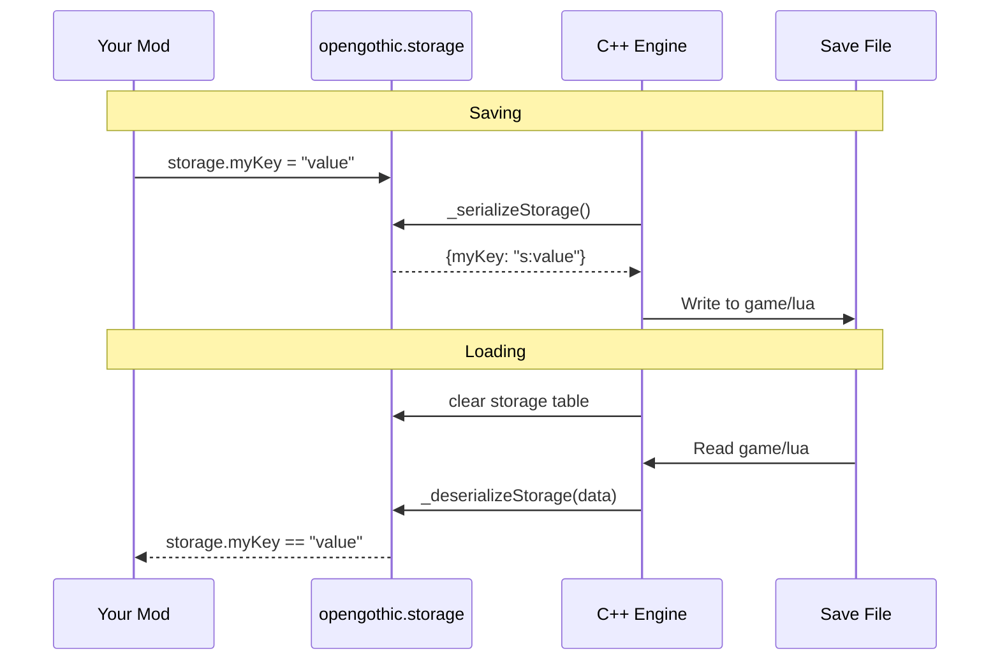

# Storage API

The storage system allows Lua scripts to persist data across game saves.

## `opengothic.storage`

A table for storing persistent data. Any data placed here is automatically
saved and restored with the game.

### Supported Types

| Type | Example |
|------|---------|
| string | `opengothic.storage.playerName = "Hero"` |
| number | `opengothic.storage.questProgress = 3` |
| boolean | `opengothic.storage.hasMetNpc = true` |

### Example

```lua
-- Store data
opengothic.storage.mymod_score = 100
opengothic.storage.mymod_completed = true

-- Retrieve data (with defaults for new games)
local score = opengothic.storage.mymod_score or 0
local done = opengothic.storage.mymod_completed or false
```

### Best Practices

1. **Prefix keys** with your mod name to avoid conflicts:
   ```lua
   opengothic.storage.mymod_variable = value
   ```

2. **Always provide defaults** when reading:
   ```lua
   local val = opengothic.storage.key or defaultValue
   ```

3. **Keep data simple** - avoid storing complex nested structures

## How It Works

The storage system integrates with OpenGothic's save system to persist your data automatically.

### Save/Load Flow



### Save File Structure

Lua storage is saved as an optional entry in the save file zip:

```
savegame.zip
├── header
├── preview.png
├── game/session
├── game/camera
├── game/perc
├── game/quests
├── game/daedalus
└── game/lua          ← Lua storage (may not exist in old saves)
```

### Type Encoding

Values are encoded with type prefixes to preserve their original types:

| Type | Prefix | Encoded | Restored |
|------|--------|---------|----------|
| string | `s:` | `"s:hello"` | `"hello"` |
| number | `n:` | `"n:42.5"` | `42.5` |
| boolean | `b:` | `"b:1"` / `"b:0"` | `true` / `false` |

Unsupported types (tables, functions, userdata) are silently ignored during serialization.

## Backward Compatibility

When loading saves created before this feature was added, `opengothic.storage`
will be an empty table. Scripts should always handle missing data gracefully
by using the `or` pattern for default values.
