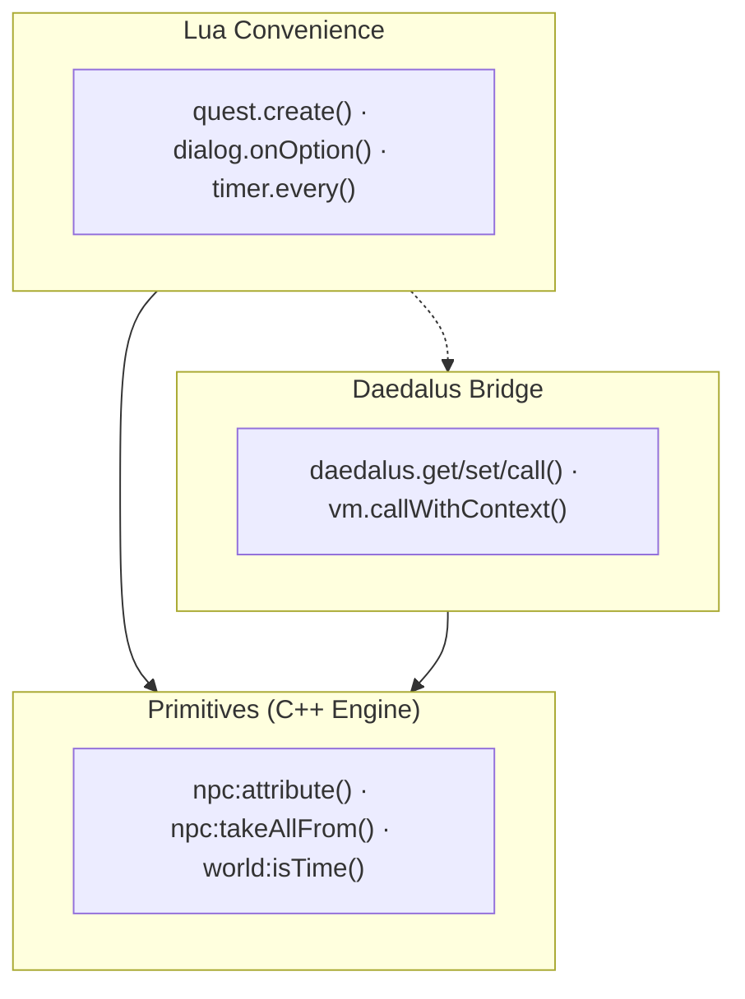

# Core Concept: API Architecture

This document explains the design philosophy behind the OpenGothic Lua scripting API. Understanding this architecture will help you choose the right tools for your mods and write more effective code.

## The Three-Layer API

The scripting API is organized into three distinct layers, each serving a different purpose:



### Primitives

**Primitives** are the foundational building blocks of the API. They are implemented in C++ and exposed directly to Lua as methods on game objects (userdata).

**Characteristics:**
- Direct access to engine functionality
- Minimal abstraction - they do exactly one thing
- Often require numeric IDs rather than string names
- Always available, even without `bootstrap.lua`
- Includes `opengothic.daedalus.*` and `opengothic.vm.*` for Daedalus interop

**Examples:**
```lua
-- Primitives work with raw IDs and direct values
local hp = npc:attribute(opengothic.CONSTANTS.Attribute.ATR_HITPOINTS)
npc:changeAttribute(opengothic.CONSTANTS.Attribute.ATR_HITPOINTS, -10, true)

local instanceId = npc:instanceId()  -- Returns a number
inventory:transfer(srcInventory, itemId, count, world)
inventory:addItem(itemId, count)

-- Daedalus bridge primitives (require loaded world)
opengothic.daedalus.call("B_GivePlayerXP", 100)
local chapter = opengothic.daedalus.get("PLAYER_CHAPTER")
```

**When to use primitives:**
- When you need precise control over game mechanics
- When building your own abstractions
- When performance is critical (fewer function calls)
- When the convenience methods don't fit your use case

### Daedalus Bridge

**Daedalus Bridge** exposes raw VM interop APIs (`opengothic.daedalus.*`, `opengothic.vm.*`) for symbol access and explicit Daedalus calls.

**Characteristics:**
- Direct symbol/function access into Daedalus VM
- **Require a loaded world** for mutating/call operations
- Useful for migration and low-level introspection
- External-function passthrough is currently unavailable (requires external-call bridge extension)

**Examples:**
```lua
-- Daedalus bridge primitives
local chapter = opengothic.daedalus.get("PLAYER_CHAPTER")
local ok, _, err = opengothic.daedalus.tryCall("B_GivePlayerXP", 100)
```

**When to use Daedalus Bridge:**
- When no convenience wrapper exists yet
- When migrating existing Daedalus logic incrementally
- For symbol-level introspection/debugging

**Lifecycle considerations:**
- These methods only work after a world is loaded
- Calling them during script load time will throw an error
- Register event handlers at load time, but call Daedalus methods inside the handlers

### Lua Convenience

**Lua convenience methods** are Lua functions defined in `bootstrap.lua` that compose primitives and safe wrappers into higher-level APIs.

**Characteristics:**
- Prefer engine primitives and safe wrappers
- Some methods call dedicated engine hooks for common workflows
- Higher-level inputs and standardized result/error shapes
- Combine multiple primitives into one convenient call

**Examples:**
```lua
-- Lua convenience methods combine primitives and safe wrappers
opengothic.quest.create("MY_QUEST")
local moved, err = opengothic.inventory.transferAll(player, chest:inventory())
local nearest = opengothic.worldutil.findNearestNpc(player, 3000)
local dmg = opengothic.DamageCalculator.calculate(attacker, victim, isSpell, spellId)  -- Uses primitives + bit32
```

**When to use Lua convenience methods:**
- When you want predictable behavior without Daedalus side effects
- For custom game mechanics that don't need original game logic
- When building reusable utilities

### Choosing Between Layers

| Scenario | Recommendation | Layer |
|----------|----------------|-------|
| Give player an item | `npc:giveItem()` | Lua Convenience |
| Custom damage calculation | `npc:changeAttribute()` | Primitive |
| Check if player has a key | `npc:hasItem()` | Lua Convenience |
| Transfer specific items with conditions | `inventory:transfer()` | Primitive |
| Get current time | `world:time()` | Primitive |
| Check if NPC is a specific type | `npc:isInstance()` | Lua Convenience |
| Check if time is in a range | `world:isTime()` | Primitive |
| Loot all items from a container | `npc:takeAllFrom()` | Primitive |
| Register option-filter rules | `dialog.onOption()` / `dialog.setOptionTimeWindow()` | Lua Convenience |
| Create a quest entry | `opengothic.quest.create()` | Lua Convenience |
| Calculate damage with spell support | `DamageCalculator.calculate()` | Lua Convenience |

---

## The Event System

The event system allows your scripts to react to game events. Understanding how it works internally helps you write effective handlers.

### Registration Order Matters

When you call `opengothic.events.register()`, your handler is added to an ordered list and you get a handler ID back. When an event fires, handlers are called **in the order they were registered**:

```lua
-- Handler A is registered first
local idA = opengothic.events.register("onNpcTakeDamage", handlerA)

-- Handler B is registered second
local idB = opengothic.events.register("onNpcTakeDamage", handlerB)

-- When onNpcTakeDamage fires:
-- 1. handlerA() is called first
-- 2. If handlerA returns false/nil, handlerB() is called
-- 3. If handlerA returns true, handlerB is NEVER called

-- Later, you can remove a specific handler by ID:
opengothic.events.unregister("onNpcTakeDamage", idB)
```

### Blocking vs. Observing

Events fall into two categories based on how they use return values:

**Blocking Events (Interception Hooks)**

These events fire *before* the default game logic. Your handler can prevent the default behavior by returning `true`.

```lua
opengothic.events.register("onNpcTakeDamage", function(victim, attacker, isSpell, spellId)
    if victim:isPlayer() then
        return true  -- Block ALL damage to player (god mode)
    end
    return false  -- Let damage proceed normally
end)
```

Common blocking events: `onNpcTakeDamage`, `onOpen`, `onRansack`, `onItemPickup`

**Notification Events**

These events fire *after* something has happened. The engine ignores their final handled state, but returning `true` still stops later Lua handlers in the same dispatch chain.

```lua
opengothic.events.register("onNpcSpawn", function(npc)
    print(npc:displayName() .. " spawned")
    return false -- keep the chain open for other mods
end)
```

Common notification events: `onNpcSpawn`, `onNpcRemove`, `onWorldLoaded`, `onSessionExit`, `onUpdate`, `onGameMinuteChanged`

### First Handler Wins

For blocking events, the first handler to return `true` stops the chain. This has important implications:

```lua
-- Mod A: Makes the player invincible
opengothic.events.register("onNpcTakeDamage", function(victim, ...)
    if victim:isPlayer() then
        return true  -- Blocks damage, stops chain
    end
    return false
end)

-- Mod B: Logs all damage (registered after Mod A)
opengothic.events.register("onNpcTakeDamage", function(victim, attacker, ...)
    print(victim:displayName() .. " took damage from " .. attacker:displayName())
    return false
end)

-- Result: Mod B's logging NEVER runs for player damage
-- because Mod A's handler returns true first
```

**Tip:** If you only want to observe an event (logging, analytics), always return `false` to let other handlers run.

---

## Script Loading

Understanding when and how scripts load helps you write reliable mods.

### Load Order

1. **Application Start**: The Lua VM is created
2. **Bootstrap**: `bootstrap.lua` runs, setting up the API
3. **Script Discovery**: Engine scans `Data/opengothic/scripts/` recursively
4. **Script Execution**: Each `.lua` file is executed in discovery order

**Important:** Discovery order depends on the filesystem and is **not guaranteed** to be consistent across different systems or runs. Do not rely on your script loading before another mod's script.

### Script Load Time vs. Event Time

Code at the top level of your script runs at **load time** (before any game session):

```lua
-- This runs immediately when the script loads (at application start)
local MY_ITEM_ID = opengothic.resolve("ITMI_GOLD")  -- May be nil before a world is loaded
print("My mod loaded!")

-- This ALSO runs at load time - it registers the handler
opengothic.events.register("onNpcTakeDamage", function(victim, ...)
    -- But this code inside runs at EVENT TIME (during gameplay)
    local player = opengothic.player()  -- Safe: world exists when event fires
end)
```

**What's safe at load time:**
- `opengothic.events.register()` - Always works
- Defining functions and variables

**What requires a world (event time only):**
- `opengothic.resolve()` - Returns `nil` if no world
- `opengothic.player()` - Returns nil if no world
- `opengothic.world()` - Returns nil if no world
- `opengothic.daedalus.set()` - Throws error if no world
- `opengothic.daedalus.call()` - Throws error if no world

See [VM Lifecycles](./lifecycles.md) for more details.

---

## Design Rationale

### Why Three Layers?

**Primitives exist because:**
- They provide maximum flexibility for advanced modders
- They're the foundation that everything else builds on
- Some tasks require direct engine access
- They have minimal overhead

**Daedalus Bridge exists because:**
- Gothic has extensive existing game logic in Daedalus
- Mods often need symbol-level interop during migration
- VM context calls and external registration are needed integration points

**Lua Convenience exists because:**
- Some helpers don't need Daedalus at all
- Combining primitives into reusable patterns reduces boilerplate
- These methods can work in more contexts (no world required for some)

### Why First-Handler-Wins?

The event system uses first-handler-wins because:
- It's simple and predictable
- It allows mods to fully "take over" game mechanics
- It matches how interception typically works (firewalls, middleware)
- It avoids complex priority systems that are hard to debug

The tradeoff is that mod compatibility requires coordination. If two mods both want to handle the same event, they need to be aware of each other or use notification-style handlers that don't block.

---

## Summary

| Concept | Key Point |
|---------|-----------|
| **Primitives** | Direct C++ methods, use numeric IDs, maximum control |
| **Daedalus Bridge** | Raw VM interop APIs (`daedalus.*`, `vm.*`); external calls currently unsupported |
| **Lua Convenience** | Lua helpers composed from primitives and safe wrappers |
| **Event Registration** | Handlers called in registration order |
| **Blocking Events** | Return `true` to stop default behavior and other handlers |
| **Notification Events** | Return value ignored, just for observation |
| **Script Loading** | Load order is filesystem-dependent, not guaranteed |
